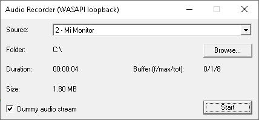

# WASAPI Loopback Recorder

A casual vibecoding hobby project. A lightweight audio capture utility for Windows. It records system audio using the Windows Audio Session API (WASAPI) loopback mode.

Built with pure C++ using only the native WinAPI.

## System Requirements
- **OS:** Windows 10 (x64 / x86)
- **Dependencies:** None (uses native Windows libraries only)

## Features (v1.0.0)
- **System Audio Capture:** Records exactly what is being rendered to the selected output device (speakers/headphones) via WASAPI Loopback.
- **Efficient Buffering:** Implements multi-threaded memory pool and ring-buffer system. For smooth data transfer between the audio capture thread and the disk writer thread.
- **Anti-Idle Silence Stream:** Includes a dedicated background thread that generates a silent audio stream. This prevents the Windows audio engine from going to sleep or pausing during quiet periods, ensuring continuous and gapless recording.
- **Real-Time Statistics:** The minimalist UI displays live recording statistics, including elapsed time, total file size, and detailed buffer fill levels (current/peak/max capacity).
- **Wave64 (W64) Output:** Saves RAW audio in the Sony Wave64 format. Unlike standard WAV, W64 uses 64-bit file size headers, completely eliminating the 4GB file size limit for long recordings.
- **Robust Error Handling:** Gracefully handles device disconnections, disk space exhaustion, and audio engine gaps, notifying the user via UI alerts without crashing.

---

## Changelog

### [1.0.0] - Initial Release
**Core Functionality:**
- Implemented WASAPI loopback audio capture.
- Added multi-threaded architecture (Capture, Writer, and Anti-Idle threads).
- Implemented custom buffer pool and thread-safe queue synchronization (Mutexes and Events).

**UI & UX:**
- Minimalist native Win32 dialog-based interface.
- Added output directory selection.
- Added live UI updates for recording time, file size, and buffer peak statistics.
- Added "Anti-Idle" toggle for the silence stream.

**Stability:**
- Added graceful shutdown and timeout handling for worker threads.
- Added error flags and UI warnings for disk write errors, capture device failures, and unexpected audio stream discontinuities.

---

## Build Instructions
1. Open the solution in **Visual Studio 2013** (or newer).
2. Build the project in `Release` mode (x64 or x86).
3. No external libraries or NuGet packages are required.

or get binaries from release section

## Technical Details
- **Language:** C++
- **API:** WinAPI, WASAPI (Core Audio APIs)
- **File Format:** Uncompressed Wave64 (W64)

## Future Roadmap / TODO:
- **Finish localization:** Complete the dynamic text loading system for multi-language support.
- **Resolve initial audio glitch:** Troubleshoot and fix the initial glitchy buffer with `AUDCLNT_BUFFERFLAGS_DATA_DISCONTINUITY` flag.
- **UI Configuration:** Expose buffer settings in the UI.
- **Audio Encoding:** Add MP3/AAC encoding via Media Foundation.
- **Manifest:** Set up the manifest file and check OS version requirements 
- **Compatibility:** Verify compatibility with Windows 7